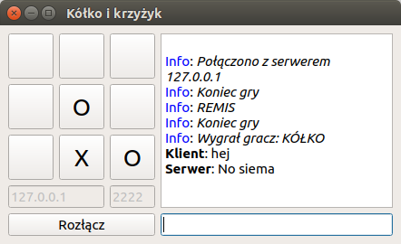

# KiKServer
_Kółko i krzyżyk - serwer (prototyp)_

Prosta gra w kółko i krzyżyk napisana w Qt5 wykorzystująca do komunikacji protokół TCP. Projekt zrezlizowany w ramach laboratoriów Systemów Operacyjnych (Politechnika Poznańska).

